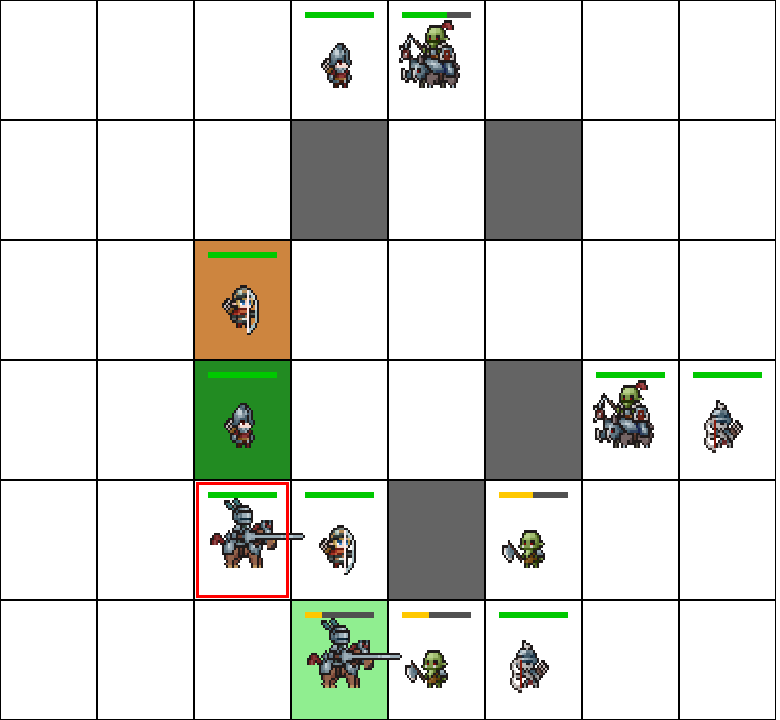

# TFG_RL – Entorno de Aprendizaje por Refuerzo para un Juego de Estrategia por Turnos

Este proyecto forma parte del Trabajo de Fin de Grado (TFG) en Ingeniería Informática en la Universitat Autònoma de Barcelona. Consiste en el diseño e implementación de un entorno compatible con Gymnasium para entrenar agentes de **aprendizaje por refuerzo (RL)** en un juego de estrategia por turnos.

## Vista previa del juego

  

 ⚠️ Por motivos de derechos de distribución, los archivos de imagen han sido **retirados del repositorio público**.  
> En su lugar, el entorno utiliza **formas geométricas básicas** (círculos, cuadrados, etc.) si no se encuentran los sprites.

## Autor

**Eric Rodríguez Merichal**  
📧 ericrmerichal@gmail.com

## Fecha de entrega

30 de junio de 2025
